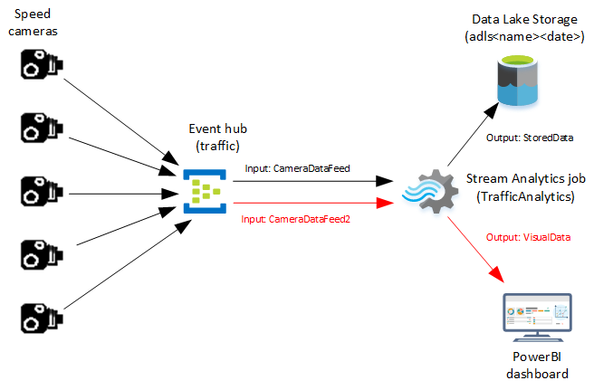
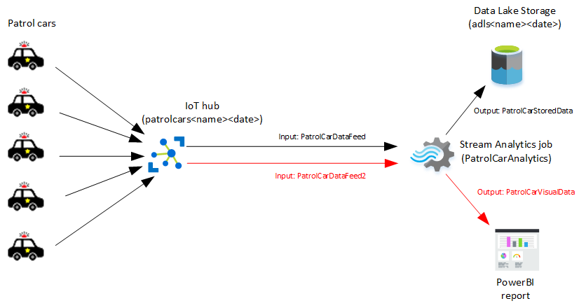
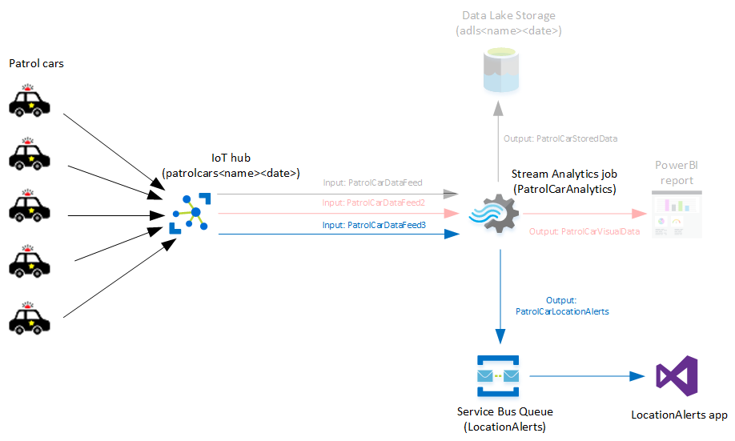
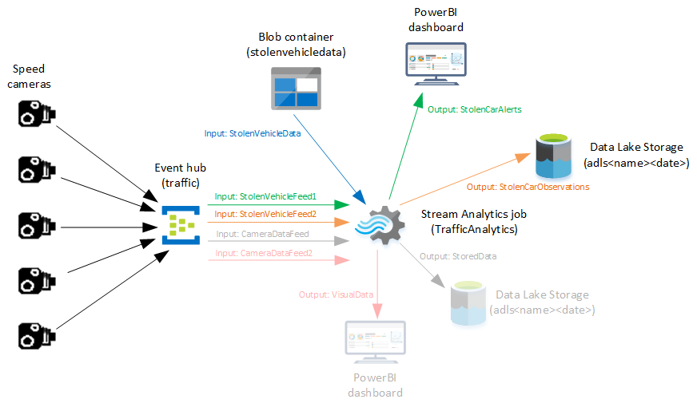
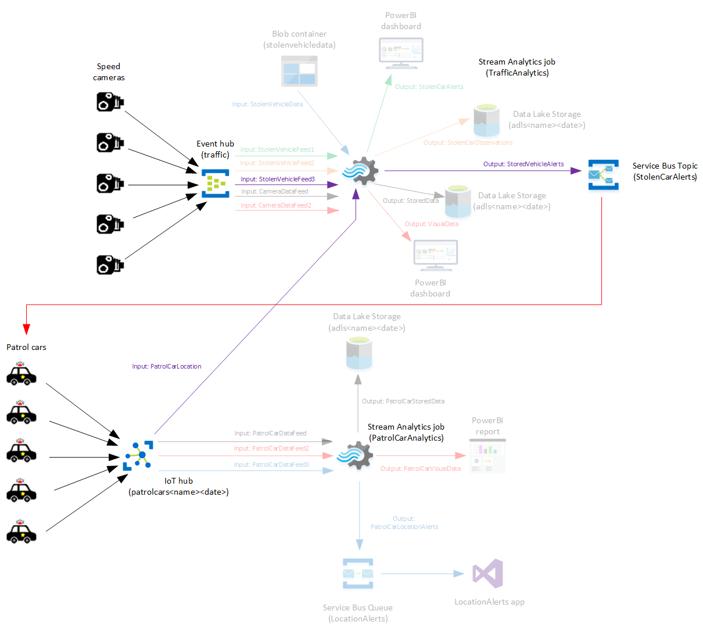

# Module 2: Processing Event Streams using Azure Stream Analytics

- [Module 2: Processing Event Streams using Azure Stream Analytics](#module-2-processing-event-streams-using-azure-stream-analytics)
    - [Lab: Process event streams with Stream Analytics](#lab-process-event-streams-with-stream-analytics)
        - [Scenario](#scenario)
        - [Objectives](#objectives)
        - [Lab Setup](#lab-setup)
    - [Exercise 1: Create a Stream Analytics job to process Event Hub data](#exercise-1-create-a-stream-analytics-job-to-process-event-hub-data)
        - [Scenario](#scenario)
        - [Task 1: Create a Data Lake Storage account](#task-1-create-a-data-lake-storage-account)
        - [Task 2: Create an event hubs namespace and hub](#task-2-create-an-event-hubs-namespace-and-hub)
        - [Task 3: Create a Stream Analytics job](#task-3-create-a-stream-analytics-job)
        - [Task 4:Configure Stream Analytics job inputs](#task-4configure-stream-analytics-job-inputs)
        - [Task 5: Configure Stream Analytics job outputs](#task-5-configure-stream-analytics-job-outputs)
        - [Task 6: Configure a Stream Analytics job query](#task-6-configure-a-stream-analytics-job-query)
        - [Task 7: Start the Stream Analytics job](#task-7-start-the-stream-analytics-job)
        - [Task 8: Generate event hub data for processing with Stream Analytics](#task-8-generate-event-hub-data-for-processing-with-stream-analytics)
        - [Task 9: Visualize Stream Analytics output using Power BI](#task-9-visualize-stream-analytics-output-using-power-bi)
        - [Task 10: View Stream Analytics output in Data Lake Store](#task-10-view-stream-analytics-output-in-data-lake-store)
        - [Task 11: Stop the TrafficAnalytics job](#task-11-stop-the-trafficanalytics-job)
    - [Exercise 2: Create a Stream Analytics job to process IoT Hub data](#exercise-2-create-a-stream-analytics-job-to-process-iot-hub-data)
        - [Scenario](#scenario)
        - [Task 1: Create an IoT Hub](#task-1-create-an-iot-hub)
        - [Task 2: Create a new Stream Analytics job](#task-2-create-a-new-stream-analytics-job)
        - [Task 3: Configure Stream Analytics job inputs](#task-3-configure-stream-analytics-job-inputs)
        - [Task 4: Configure Stream Analytics job outputs](#task-4-configure-stream-analytics-job-outputs)
        - [Task 5: Configure the Stream Analytics job query](#task-5-configure-the-stream-analytics-job-query)
        - [Task 6: Start the Stream Analytics job](#task-6-start-the-stream-analytics-job)
        - [Task 7: Generate IoT hub data for processing with Stream Analytics](#task-7-generate-iot-hub-data-for-processing-with-stream-analytics)
        - [Task 8: Visualize Stream Analytics output using Power BI](#task-8-visualize-stream-analytics-output-using-power-bi)
        - [Task 9: View Stream Analytics output in Azure Data Lake Store](#task-9-view-stream-analytics-output-in-azure-data-lake-store)
        - [Task 10: Stop the PatrolCarAnalytics job](#task-10-stop-the-patrolcaranalytics-job)
    - [Exercise 3: Reconfigure a Stream Analytics job to send output through a Service Bus queue](#exercise-3-reconfigure-a-stream-analytics-job-to-send-output-through-a-service-bus-queue)
        - [Scenario](#scenario)
        - [Task 1: Create a Service Bus namespace and queue](#task-1-create-a-service-bus-namespace-and-queue)
        - [Task 2: Reconfigure the IoT Hub](#task-2-reconfigure-the-iot-hub)
        - [Task 3: Reconfigure the PatrolCarAnalytics Stream Analytics job](#task-3-reconfigure-the-patrolcaranalytics-stream-analytics-job)
        - [Task 4: Start the Stream Analytics job](#task-4-start-the-stream-analytics-job)
        - [Task 5: Prepare an application to receive Stream Analytics data using a Service Bus](#task-5-prepare-an-application-to-receive-stream-analytics-data-using-a-service-bus)
        - [Task 6: Generate IoT Hub data for processing with Stream Analytics](#task-6-generate-iot-hub-data-for-processing-with-stream-analytics)
    - [Exercise 4: Reconfigure a Stream Analytics job to process both event hub and static file data](#exercise-4-reconfigure-a-stream-analytics-job-to-process-both-event-hub-and-static-file-data)
        - [Scenario](#scenario)
        - [Task 1: Create a Blob storage account for holding stolen vehicle data](#task-1-create-a-blob-storage-account-for-holding-stolen-vehicle-data)
        - [Task 2: Examine the StolenVehiclesReport.csv file](#task-2-examine-the-stolenvehiclesreportcsv-file)
        - [Task 3: Use Azure Storage Explorer to upload a StolenVehiclesReport.csv to the Blob storage container](#task-3-use-azure-storage-explorer-to-upload-a-stolenvehiclesreportcsv-to-the-blob-storage-container)
        - [Task 4: Update the event hub and add two more consumer groups](#task-4-update-the-event-hub-and-add-two-more-consumer-groups)
        - [Task 5: Reconfigure the TrafficAnalytics Stream Analytics job inputs](#task-5-reconfigure-the-trafficanalytics-stream-analytics-job-inputs)
        - [Task 6: Reconfigure the TrafficAnalytics Azure Stream Analytics job outputs](#task-6-reconfigure-the-trafficanalytics-azure-stream-analytics-job-outputs)
        - [Task 7: Reconfigure the TrafficAnalytics Stream Analytics job query](#task-7-reconfigure-the-trafficanalytics-stream-analytics-job-query)
        - [Task 8: Start the TrafficAnalytics Stream Analytics job](#task-8-start-the-trafficanalytics-stream-analytics-job)
        - [Task 9: Generate event hub data for processing with Stream Analytics](#task-9-generate-event-hub-data-for-processing-with-stream-analytics)
        - [Task 10: Visualize Stream Analytics output using Power BI](#task-10-visualize-stream-analytics-output-using-power-bi)
        - [Task 11: View Stream Analytics output in Data Lake Store](#task-11-view-stream-analytics-output-in-data-lake-store)
    - [Exercise 5: Use multiple Stream Analytics jobs to process event hub, IoT hub and static file data, and output results using a Service Bus and custom application](#exercise-5-use-multiple-stream-analytics-jobs-to-process-event-hub-iot-hub-and-static-file-data-and-output-results-using-a-service-bus-and-custom-application)
        - [Scenario](#scenario)
        - [Task 1: Create a new Service Bus topic and add a subscription](#task-1-create-a-new-service-bus-topic-and-add-a-subscription)
        - [Task 2: Reconfigure the IoT hub and add a new consumer group](#task-2-reconfigure-the-iot-hub-and-add-a-new-consumer-group)
        - [Task 3: Reconfigure the event hub and add a new consumer group](#task-3-reconfigure-the-event-hub-and-add-a-new-consumer-group)
        - [Task 4: Reconfigure the TrafficAnalytics Azure Stream Analytics job inputs](#task-4-reconfigure-the-trafficanalytics-azure-stream-analytics-job-inputs)
        - [Task 5: Reconfigure the TrafficAnalytics Stream Analytics job outputs](#task-5-reconfigure-the-trafficanalytics-stream-analytics-job-outputs)
        - [Task 6: Reconfigure the TrafficAnalytics Stream Analytics job query](#task-6-reconfigure-the-trafficanalytics-stream-analytics-job-query)
        - [Task 7: Start the TrafficAnalytics Azure and PatrolCarAnalytics Stream Analytics jobs](#task-7-start-the-trafficanalytics-azure-and-patrolcaranalytics-stream-analytics-jobs)
        - [Task 8: Generate event hub and IoT hub data for processing with Stream Analytics](#task-8-generate-event-hub-and-iot-hub-data-for-processing-with-stream-analytics)
        - [Task 9: Start an application to receive Stream Analytics data using a Service Bus topic](#task-9-start-an-application-to-receive-stream-analytics-data-using-a-service-bus-topic)
    - [Exercise 6: Use the Azure portal and Azure PowerShell to manage and scale Stream Analytics jobs](#exercise-6-use-the-azure-portal-and-azure-powershell-to-manage-and-scale-stream-analytics-jobs)
        - [Scenario](#scenario)
        - [Task 1: Add a monitoring alert to a Stream Analytics job](#task-1-add-a-monitoring-alert-to-a-stream-analytics-job)
        - [Task 2: Use the Azure portal to scale up a Stream Analytics job](#task-2-use-the-azure-portal-to-scale-up-a-stream-analytics-job)
        - [Task 3: Use Azure PowerShell to stop a Stream Analytics job](#task-3-use-azure-powershell-to-stop-a-stream-analytics-job)
        - [Task 4: Use Azure PowerShell to scale down and restart a Stream Analytics job](#task-4-use-azure-powershell-to-scale-down-and-restart-a-stream-analytics-job)
        - [Task 5: Use job diagrams to visualize Stream Analytics job configurations](#task-5-use-job-diagrams-to-visualize-stream-analytics-job-configurations)
        - [Task 6: Lab closedown](#task-6-lab-closedown)

## Lab: Process event streams with Stream Analytics

### Scenario

You work for Adatum as a data engineer, and have been asked to build a traffic surveillance system for traffic police. This system must be able to analyze significant amounts of dynamically streamed data, captured from speed cameras and automatic number plate recognition (ANPR) devices, and then crosscheck the outputs against large volumes of reference data that holds vehicle, driver, and location information. Fixed roadside cameras, hand-held cameras (held by traffic police), and mobile cameras (in police patrol cars) are used to monitor traffic speeds and raise an alert if a vehicle is travelling too quickly for the local speed limit. The cameras also have built-in ANPR software that reads vehicle registration plates.

For the first phase of the project, you will use Stream Analytics, together with Event Hubs, IoT Hubs, Service Bus, and custom applications to:

- Provide insights into average speeds at various locations.
- Determine the locations of police patrol cars.
- Present vehicle locations on a map.
- Check vehicles recorded by speed cameras against a list of stolen vehicles.
- Determine the nearest patrol car to a speeding vehicle or stolen vehicle, send a dispatch alert to the nearest patrol car, and show the dispatched patrol car locations on a map.
- Use Stream Analytics monitoring and alerting tools to help identify issues during the system's deployment, and use the Azure portal and PowerShell to scale up and scale down the system to cope with particular demands.

### Objectives

After completing this lab, you will be able to:

- Create a Stream Analytics job to process Event Hub data.
- Create a Stream Analytics job to process IoT Hub data.
- Reconfigure a Stream Analytics job to send output through a Service Bus queue.
- Reconfigure a Stream Analytics job to process both event hub and static file data.
- Use multiple Stream Analytics jobs to process event hub, IoT Hub and static file data, and output results using a Service Bus and custom application.
- Use the Azure portal and PowerShell to manage and scale Stream Analytics jobs.

### Lab Setup

Estimated time: 120 minutes
Virtual machine: **20776A-LON-DEV**  
User name: **ADATUM\AdatumAdmin**  
Password: **Pa55w.rd**

> **Important**: Due to the CPU-intensive nature of some of the tasks performed by the applications in this lab, it is recommended that you assign at least 4 virtual processors to the 20776A-LON-DEV VM before starting this lab. To do this, perform the following steps:
>   1. Shutdown the 20776A-LON-DEV VM if it is currently running
>   2. Using Hyper-V Manager, right-click the 20776A-LON-DEV VM, and then click **Settings**
>   3. Click **Processor**
>   4. In the **Processor** pane, increase **Number of virtual processors** to 4
>   5. Click **OK**
>   6. Restart the 20776A-LON-DEV VM

## Exercise 1: Create a Stream Analytics job to process Event Hub data

### Scenario

For the first phase of the project, you will start to build the traffic surveillance system to provide insights into average speeds at various locations. In this exercise, you will create a Stream Analytics job that captures speed camera data sent to an event hub from a Visual Studio application (SpeedCameraDevice). You will configure the Stream Analytics job to send output data to a Power BI dashboard and to Azure Data Lake Storage, using filters to remove unnecessary fields before storage.



The main tasks for this exercise are as follows:

1. Create a Data Lake Storage account
2. Create an event hubs namespace and hub
3. Create a Stream Analytics job
4. Configure Stream Analytics job inputs
5. Configure Stream Analytics job outputs
6. Configure a Stream Analytics job query
7. Start a Stream Analytics job
8. Generate event hub data for processing with Stream Analytics
9. Visualize Stream Analytics output using Power BI
10. View Stream Analytics output in Data Lake Store
11. Stop the TrafficAnalytics job

### Task 1: Create a Data Lake Storage account

1. Using the Microsoft account that is associated with your Azure Learning Pass subscription, use the Azure portal to create a Data Lake Store, with the following details:
    - **Name**: adls&lt;_your name_&gt;&lt;_date_&gt;
    - **Resource group (Create new)**: CamerasRG
    - **Location**: Select your nearest location from the currently available Data Lake Store regions
    - Leave all other settings at their defaults
2.  Wait until the storage has deployed before continuing with the lab.

### Task 2: Create an event hubs namespace and hub

1. Create an event hub namespace blade, with the following details:
    - **Name**: camerafeeds&lt;your name&gt;&lt;date&gt;
    - **Resource group (Use existing)**: CamerasRG
    - **Location**: Select the same location as you used for the Data Lake Store
    - Leave all other settings at their defaults
2. Wait until the namespace has deployed before continuing with the lab.
3. Add an event hub to your event hub namespace, with the following details:
    - **Name**: traffic
    - **Partition count**: 16
    - Leave all other settings at their defaults
4. Wait until the event hub has deployed before continuing with the lab.
5. Add a consumer group to the traffic event hub, with the following details:
    - **Name**: cameradatafeed
6. Add a second consumer group to the traffic event hub , with the following details:
    - **Name**: cameradatafeed2
7. Copy the **Primary Key** for your event hubs namespace **RootManageSharedAccessKey** policy, and save it as **Config\_details.txt** in the **E:\\Labfiles\\Lab02** folder.

### Task 3: Create a Stream Analytics job

1. Create a Stream Analytics job, with the following details:
    - **Job name**: TrafficAnalytics
    - **Resource group (Use existing)**: CamerasRG
    - **Location**: Select the same location as you used for the Data Lake Store.
2. Wait until the Stream Analytics job has deployed before continuing with the lab.

### Task 4:Configure Stream Analytics job inputs

1. Add an Event Hub input to the TrafficAnalytics Stream Analytics job, with the following details:
    - **Input alias**: CameraDataFeed
    - **Provide Event Hub settings manually** selected
    - **Service Bus namespace**: camerafeeds&lt;_your name_&gt;&lt;_date_&gt; as you created earlier
    - **Event Hub name**: traffic
    - **Event Hub policy name**: RootManageSharedAccessKey
    - **Event Hub policy key**: Paste the key you copied into Config\_details.txt
    - **Event Hub consumer group**: cameradatafeed
2. Leave all other settings at their defaults.
3. Wait until the input has been successfully created before continuing with the lab.
4. Add a second Event Hub input to the TrafficAnalytics Stream Analytics job, with the following details:
    - **Input alias**: CameraDataFeed2
    - **Provide Event Hub settings manually**: selected
    - **Service Bus namespace**: camerafeeds&lt;_your name_&gt;&lt;_date_&gt; as you created earlier
    - **Event Hub name**: traffic
    - **Event Hub policy name**: RootManageSharedAccessKey
    - **Event Hub policy key**: Paste the key you copied to Config\_details.txt
    - **Event Hub consumer group**: cameradatafeed2
5. Leave all other settings at their defaults.
6. Wait until the input has been successfully created before continuing with the lab.

### Task 5: Configure Stream Analytics job outputs

1. Add a Power BI output to the TrafficAnalytics Stream Analytics job, with the following details:
    - **Output alias**: VisualData
    - Click **Sign up** to create a new Power BI account, then click **Authorize**, and sign in using your Power BI credentials. Click **Sign up** and create a new PowerBI account if you don't already have one.
    - **Dataset Name**: TrafficData
    - **Table Name**: TrafficData
2. Wait until the output has been successfully created before continuing with the lab.
3. Add a second output to the TrafficAnalytics Stream Analytics job, with the following details:
    - **Output alias**: StoredData
    - **Sink**: Data Lake Store
    - Click **Authorize**, and sign in using your Power BI credentials (you might not be prompted this time).
    - **Path prefix pattern**: SpeedData/{date}/{time}
    - Leave all other settings at their defaults
4. Wait until the output has been successfully created before continuing with the lab.

### Task 6: Configure a Stream Analytics job query

- Add the following query to the TrafficAnalytics Stream Analytics job:

    ```SQL
    SELECT
      CameraID,VehicleRegistration,Speed,SpeedLimit,LocationLatitude,LocationLongitude,Time
    INTO
      StoredData
    FROM
      CameraDataFeed

    SELECT
      CameraID, AVG(Speed) AS AvgSpeed
    INTO
      VisualData
    FROM
      CameraDataFeed2
    TIMESTAMP BY
      Time
    GROUP BY
      CameraID, TumblingWindow(second, 30)
    ```
You can copy the preceding commands from the file **E:\\Labfiles\\Lab02\\ASAquery1.txt**.

### Task 7: Start the Stream Analytics job

1. Start the TrafficAnalytics Stream Analytics job.
2. Wait until the job has successfully started before continuing with the lab.

### Task 8: Generate event hub data for processing with Stream Analytics

1. Start Visual Studio, and open the **E:\\Labfiles\\Lab02\\SpeedCameraDevice\\SpeedCameraDevice.sln** project.
2. Edit the **appSettings** section of **App.config** and replace the text **YourNamespace** in the Endpoint value with **camerafeeds&lt;_your name_&gt;&lt;_date_&gt;**.
3. Also in the Endpoint value, replace the text **YourPrimaryKey** with the primary key you copied to **Config\_details.txt**.
4. Set **SpeedCameraDriver** as the startup project.
5. Build the solution, and verify that the app compiles successfully.
6. Start the app; it opens a console window displaying generated speed camera data that is being sent to the event hub.

### Task 9: Visualize Stream Analytics output using Power BI

1. In Internet Explorer, open a new tab and go to **https://powerbi.microsoft.com**. If prompted, sign in using your Power BI account credentials.
2. Verify that a streaming dataset named **TrafficData** is available (if this does not appear, wait a few minutes and then refresh the page).
3. Create a new dashboard called **Traffic**.
4. Add a custom streaming data tile, with the following details:
    - **Source**: TrafficData
    - **Visualization Type**: Clustered column chart
    - **Axis**: cameraid
    - **Value**: avgspeed
    - **Time window to display**: 30 seconds
    - **Title**: Camera speeds
5. Resize the tile so that it occupies most of the visible dashboard.
6. Leave the tile to display for a few minutes; note that it summarizes information about the average speeds recorded by each camera during the last 30-second interval.

### Task 10: View Stream Analytics output in Data Lake Store

1. Use the Data Explorer for your Data Lake Store to view the subfolders under **SpeedData**.
2. Open the log file in File Preview; verify that the data includes the fields you specified in your Azure Stream Analytics query.

### Task 11: Stop the TrafficAnalytics job

1. Stop the TrafficAnalytics Stream Analytics job.
2. In the Visual Studio app window (where the data is being generated), press Enter to stop the app.

>**Result**: In this exercise, you created an Azure Data Lake Store, an event hubs namespace, and a Stream Analytics job. You used Stream Analytics to process event hubs data, and viewed the results in a Power BI dashboard and in Data Lake Store.

## Exercise 2: Create a Stream Analytics job to process IoT Hub data

### Scenario

You will now add the locations of police patrol cars to the traffic surveillance system. In this exercise, you will create a second Stream Analytics job that captures patrol car location data from an IoT hub (using a Visual Studio application, PatrolCarDevice, to generate the raw data). You will configure the Stream Analytics job to send data to a Power BI report and to Data Lake Storage.



The main tasks for this exercise are as follows:

1. Create an IoT hub
2. Create a new Stream Analytics job
3. Configure Stream Analytics job inputs
4. Configure Stream Analytics job outputs
5. Configure the Stream Analytics job query
6. Start the Stream Analytics job
7. Generate IoT hub data for processing with Stream Analytics
8. Visualize Stream Analytics output using Power BI
9. View Stream Analytics output in Azure Data Lake Store
10. Stop the PatrolCarAnalytics job

### Task 1: Create an IoT Hub

1. Create an IoT hub, with the following details:
    - **Name**: patrolcars&lt;_your name_&gt;&lt;_date_&gt;
    - **Pricing and scale tier**: F1 Free
    - **Resource group (Use existing)**: CamerasRG
    - **Location**: Select the same location as you used for the Data Lake Store in Exercise 1
2. Wait until the IoT hub has deployed before continuing with the lab.
3. Add two consumer groups to the IoT hub, called **patrolcars** and **patrolcars2**.
4. Copy the Hostname and the Connection string primary key for the iothubowner Shared access policy to the Config\_details.txt file.

### Task 2: Create a new Stream Analytics job

1. Create a Stream Analytics job, with the following details:
    - **Job name**: PatrolCarAnalytics
    - **Resource group (Use existing)**: CamerasRG
    - **Location**: Select the same location as you used for the Data Lake Store
    - **Streaming units**: 1
2. Wait until the Stream Analytics job has deployed before continuing with the lab.

### Task 3: Configure Stream Analytics job inputs

1. Add an IoT Hub streaming input to the PatrolCarAnalytics Stream Analytics job, with the following details:
    - **Input alias**: PatrolCarDataFeed
    - **Select IoT Hub from your subscriptions**: Selected
    - **Consumer group**: patrolcars
    - Leave all other settings at their defaults
2. Wait until the input has been successfully created before continuing with the lab.
3. Add a second IoT Hub streaming input to the PatrolCarAnalytics Stream Analytics job, with the following details:
    - **Input alias**: PatrolCarDataFeed2
    - **Select IoT Hub from your subscriptions**: Selected
    - **Consumer group**: patrolcars2
    - Leave all other settings at their defaults
4. Wait until the input has been successfully created before continuing with the lab.

### Task 4: Configure Stream Analytics job outputs

1. Add a Power BI output to the PatrolCarAnalytics Stream Analytics job, with the following details:
    - **Output alias**: PatrolCarVisualData
    - **Dataset Name**: PatrolCarData
    - **Table Name**: RealTimeData
    - Click **Authorize**, and (if prompted) enter your Power BI credentials

    > **Note:** The table name is important. You will use the ArcGIS Map control in Power BI to visualize the data, and this control always expects the data source to be named **RealTimeData**.

2. Wait until the output has been successfully created before continuing with the lab.
3. Add a Data Lake Store output to the PatrolCarAnalytics Stream Analytics job, with the following details:
    - **Output alias**: PatrolCarStoredData
    - **Select Data Lake Store from your subscriptions**: Selected
    - **Path prefix pattern**: PatrolCarData/{date}/{time}
    - Click **Authorize**, and (if prompted) enter your Power BI credentials
    - Leave all other settings at their defaults
4. Wait until the output has been successfully created before continuing with the lab.

### Task 5: Configure the Stream Analytics job query

- Add the following query to the PatrolCarAnalytics Stream Analytics job:

    ```SQL
    SELECT
      CarID,LocationLatitude,LocationLongitude,System.TimeStamp AS Time
    INTO
      PatrolCarVisualData
    FROM
      PatrolCarDataFeed

    SELECT
      *
    INTO
      PatrolCarStoredData
    FROM
      PatrolCarDataFeed2
    ```

You can copy the preceding commands from the file **E:\\Labfiles\\Lab02\\ASAquery2.txt**.

### Task 6: Start the Stream Analytics job

1. Start the PatrolCarAnalytics Stream Analytics job.
2. Wait until the job has successfully started before continuing with the lab.

### Task 7: Generate IoT hub data for processing with Stream Analytics

1. Start Visual Studio, and open the **E:\\Labfiles\\Lab02\\PatrolCarDevice\\PatrolCarDevice.sln** project.
2. In the **appSettings** section of **App.config**, in the **IoTHubConnectionString** and **IotHubUri** values, replace the text **YourIoTHub** with **patrolcars&lt;_your name_&gt;&lt;_date_&gt;**.
3. In the **appSettings** section of **App.config**, in the **IoTHubConnectionString** value, replace the text **YourPrimaryKey** with the primary key you copied to **Config\_details.txt**.
4. Build the solution, and verify that the app compiles successfully.
5. Start the app, and verify that the app opens a console window displaying the generated positions of patrol cars that are sent to the IoT hub.

### Task 8: Visualize Stream Analytics output using Power BI

1. In Power BI, verify that a streaming dataset named **PatrolCarData** is available (if this does not appear, wait a few minutes then refresh the page).
2. Create a report, with the following details:
    - **Source**: PatrolCarData
    - **Fields pane**: Select all the data fields
    - **Visualizations pane**: Select ArcGIS Maps for Power BI
3. You will need to edit the properties of the **Latitude** and **Longitude** fields in the **VISUALIZATIONS** pane as follows:
    - In the **Latititude** box, click the drop-down arrow by the **Average of locationlatitude** value, and then click **Don't summarize**.
    - In the **Longitude** box, click the drop-down arrow by the **Average of locationlongtude** value, and then click **Don't summarize**.

4. You might need to resize the map control and zoom in to make it larger.
5. The report shows a history of the movements of each patrol car.

   > **Note:** The data displayed by the report is cumulative; you need to click **Refresh** to update the report.

### Task 9: View Stream Analytics output in Azure Data Lake Store

1. Use the Data Explorer for your Data Lake Store to view the subfolders under PatrolCarData.
2. Open one of the JSON files in File Preview; verify that the data includes the fields you specified in your Stream Analytics query.
3. Stop the PatrolCarAnalytics Stream Analytics job.
4. In the Visual Studio app window (where the data is being generated), press Enter to stop the app.

### Task 10: Stop the PatrolCarAnalytics job

1. Stop the PatrolCarAnalytics Stream Analytics job.
2. In the Visual Studio app window (where the data is being generated), press Enter to stop the app.

>**Result**: In this exercise, you created a Data Lake Store, an IoT hub, and a new Stream Analytics job. You used Stream Analytics to process IoT hub data, and viewed the results in a Power BI report and in Data Lake Store.

## Exercise 3: Reconfigure a Stream Analytics job to send output through a Service Bus queue

### Scenario

After you have added the locations of police patrol cars to the system, it becomes clear that a better, more visual, approach is needed by presenting vehicle locations on a map. In this exercise, you will add an input to the PatrolCarAnalytics Azure Stream Analytics job that captures patrol car locations—and displays the results on a map—by using a simple custom Visual Studio application that listens to a Service Bus queue. This exercise demonstrates how to overcome the shortcomings of trying to show this type of data in a Power BI report, and illustrates how to send data from a Stream Analytics job to another application instead of directly to an output such as Power BI.



The main tasks for this exercise are as follows:

1. Create a Service Bus namespace and queue
2. Reconfigure the IoT Hub
3. Reconfigure the PatrolCarAnalytics Stream Analytics job
4. Start the Stream Analytics job
5. Prepare an application to receive Stream Analytics data using a Service Bus
6. Generate IoT Hub data for processing with Stream Analytics

### Task 1: Create a Service Bus namespace and queue

1. Create a Service Bus namespace, with the following details:
    - **Name**: locationalerts&lt;_your name_&gt;&lt;_date_&gt;
    - **Pricing tier**: Standard
    - **Resource group (Use existing)**: CamerasRG
    - **Location**: Select the same location as you used for the Data Lake Store
2. Wait until the Service Bus namespace has been created before continuing with the lab.
3. Copy the **Primary Key** for the **RootManageSharedAccessKey** Shared access policy to **Config\_details.txt**.
4. Create a queue called **LocationAlerts**.
5. Wait until the queue has been successfully created before continuing with the lab.

### Task 2: Reconfigure the IoT Hub

- Add a consumer group named **patrolcars3** to the IoT hub that you created in the previous exercise.

### Task 3: Reconfigure the PatrolCarAnalytics Stream Analytics job

1. Add an IoT streaming input to the PatrolCarAnalytics Stream Analytics job, with the following details:
    - **Input alias**: PatrolCarDataFeed3
    - **Select IoT Hub from your subscriptions**: Selected
    - **IoT Hub**: Specify your IoT hub
    - **Consumer group**: patrolcars3
    - Leave all other settings at their defaults
2. Add a Service Bus queue output to the PatrolCarAnalytics Stream Analytics job with the following details:
    - **Output alias**: PatrolCarLocationAlerts
    - **Select queue from your subscriptions**: Selected
    - **Servie Bus namespace**: locationalerts&lt;_your name_&gt;&lt;_date_&gt;
    - **Queue name**: locationalerts
    - Leave all other settings at their defaults
3. Wait until the input and output have been successfully created before continuing with the lab.
4. Add the following to the end of the existing job query:

   ```SQL
   SELECT
     CarID,CarNum,LocationLatitude,LocationLongitude,Speed
   INTO
     PatrolCarLocationAlerts
   FROM
     PatrolCarDataFeed3
   ```

You can copy the preceding commands from the file **E:\\Labfiles\\Lab02\\ASAquery3.txt**.

### Task 4: Start the Stream Analytics job

1. Start the PatrolCarAnalytics Stream Analytics job.
2. Wait until the job has successfully started before continuing with the lab.

### Task 5: Prepare an application to receive Stream Analytics data using a Service Bus

1. Start a new instance of Visual Studio, and open the **E:\\Labfiles\\Lab02\\LocationAlerts\\LocationAlerts.sln** project; this project displays the movements of patrol cars that it receives from the queue.
2. Edit **ConfigSettings.txt**, and replace **YourServiceBusName** with **locationalerts&lt;_your name_&gt;&lt;_date_&gt;**.
3. Edit **ConfigSettings.txt**, and replace **YourPrimaryKey** with the primary key from the service bus connection string you copied to **Config\_details.txt**.
4. Build the solution, and verify that the app compiles successfully.
5. Start the app (on the Local Machine), and verify that the app displays a map (of London), but not the positions of any patrol cars yet.

### Task 6: Generate IoT Hub data for processing with Stream Analytics

1. Switch to your first instance of Visual Studio, and restart the **PatrolCarDevice** app to generate patrol car movements.
2. Switch to the map displayed by the LocationAlerts app.
3. Verify that, after a few seconds, the locations of patrol cars start appearing on the map—and that these positions slowly change as patrol cars are driven around.
4. Allow the system to run for a while then stop the PatrolCarAnalytics job, PatrolCarDevice app, and LocationAlerts app.
5. Close both instances of Visual Studio.

>**Result**: In this exercise, you created an Azure Service Bus namespace, and reconfigured an existing IoT hub and an existing Stream Analytics job. You used Stream Analytics to process IoT hub data and to send results to a Service Bus queue. Finally, used a custom application to visualize the data received from the Service Bus.

## Exercise 4: Reconfigure a Stream Analytics job to process both event hub and static file data

### Scenario

The next requirement for the traffic surveillance system is to add a facility for checking the vehicles recorded by speed cameras against a list of stolen vehicles. In this exercise, you will edit the Stream Analytics job from Exercise 1 (TrafficAnalytics) to detect whether a vehicle observed in a speed camera is stolen. You will create an Azure Storage block blob and upload a file containing static vehicle theft records, and use this file as input reference data for the Stream Analytics job (in addition to the speed camera data). To achieve this, you will update the event hub that you used in Exercise 1, and add two more consumer groups (this is a best practice, because you will use the event hub to provide two additional inputs to Stream Analytics). You will configure Stream Analytics to send the results to a Power BI dashboard, and to a JSON format file in Data Lake Store, organized by date and time.



The main tasks for this exercise are as follows:

1. Create a Blob storage account for holding stolen vehicle data
2. Examine the StolenVehiclesReport.csv file
3. Use Azure Storage Explorer to upload a StolenVehiclesReport.csv to the Blob storage container
4. Update the event hub and add two more consumer groups
5. Reconfigure the TrafficAnalytics Stream Analytics job inputs
6. Reconfigure the TrafficAnalytics Azure Stream Analytics job outputs
7. Reconfigure the TrafficAnalytics Stream Analytics job query
8. Start the TrafficAnalytics Stream Analytics job
9. Generate event hub data for processing with Stream Analytics
10. Visualize Stream Analytics output using Power BI
11. View Stream Analytics output in Data Lake Store

### Task 1: Create a Blob storage account for holding stolen vehicle data

1. Create a storage account, with the following details:
    - **Resource group (Use existing)**: CamerasRG
    - **Name**: datastore&lt;_your name_&gt;&lt;_date_&gt;
    - **Location**: Select the same location as you used for the Data Lake Store
    - **Account kind**: Blob storage
    - Leave all other details at their defaults
2. Wait until the storage account has been successfully created before continuing with the lab.
3. Add a private blob container named **stolenvehicledata** to the storage account.

### Task 2: Examine the StolenVehiclesReport.csv file

1. Using Excel, open **E:\\Labfiles\\Lab02\\StolenVehiclesReport.csv**. This file contains the registration number, date stolen, and date recovered for stolen vehicles. If a vehicle is still missing, the date recovered is empty.
2. Close the file.

### Task 3: Use Azure Storage Explorer to upload a StolenVehiclesReport.csv to the Blob storage container

1. Open Microsoft Azure Storage Explorer, and sign in using the credentials for the Microsoft account that is associated with your Azure Learning Pass subscription.
2. Upload **E:\\Labfiles\\Lab02\\StolenVehiclesReport.csv** to the **stolenvehicledata** container.
3. When the upload is complete, close Storage Explorer.

### Task 4: Update the event hub and add two more consumer groups

- Add the following consumer groups to the event hub:
    - stolenvehiclefeed1
    - stolenvehiclefeed2

### Task 5: Reconfigure the TrafficAnalytics Stream Analytics job inputs

1. Add a Blob storage reference input to the TrafficAnalytics Stream Analytics job, with the following details:
    - **Input alias**: StolenVehicleData
    - **Select Blob storage from your subscriptions**: selected
    - **Storage account**: datastore&lt;_your name_&gt;&lt;_date_&gt;
    - **Container**: stolenvehicledata
    - **Path pattern**: StolenVehiclesReport.csv
    - **Event serialization format**: CSV
    - Leave all other settings at their defaults
2. Add an Event Hub stream input to the TrafficAnalytics Stream Analytics job, with the following details:
    - **Input alias**: StolenVehicleFeed1
    - **Select Event Hub from your subscriptions**: selected
    - **Event Hub namespace**: camerafeeds_your name_&gt;&lt;_date_&gt;
    - **Event Hub name**: traffic
    - **Event Hub consumer group**: stolenvehiclefeed1
    - Leave all other settings at their defaults
3. Add another Event Hub stream input to the TrafficAnalytics Stream Analytics job, with the following details:
    - **Input alias**: StolenVehicleFeed2
    - **Select Event Hub from your subscriptions**: selected
    - **Event Hub namespace**: camerafeeds_your name_&gt;&lt;_date_&gt;
    - **Event Hub name**: traffic
    - **Event hub consumer group**: stolenvehiclefeed2
    - Leave all other settings at their defaults
4. Wait until the inputs have been successfully created before continuing with the lab.

### Task 6: Reconfigure the TrafficAnalytics Azure Stream Analytics job outputs

1. Add a Power BI output to the TrafficAnalytics Stream Analytics job, with the following details:
    - **Output alias**: StolenCarAlerts
    - **Dataset name**: StolenCarAlerts
    - **Table name**: StolenCarAlerts
    - Click **Authorize**, and (if prompted) enter your Power BI credentials.
2. Add a Data Lake Store output to the TrafficAnalytics Stream Analytics job, with the following details:
    - **Output alias**: StolenCarObservations
    - **Select Data Lake Store from your subscriptions**: selected
    - **Account name**: adls_your name_&gt;&lt;_date_&gt;
    - **Path prefix pattern**: StolenCarObservations/{date}/{time}
    - Click **Authorize**, and (if prompted) enter your Azure credentials
    - Leave all other settings at their defaults
3. Wait until the outputs have been successfully created before continuing with the lab.

### Task 7: Reconfigure the TrafficAnalytics Stream Analytics job query

- Add the following statements to the end of the existing TrafficAnalytics Stream Analytics job query:

    ```SQL
    SELECT
      C.VehicleRegistration,C.LocationLatitude,C.LocationLongitude,C.Time
    INTO
      StolenCarAlerts
    FROM
      StolenVehicleFeed1 C
    JOIN
      StolenVehicleData V
    ON
      C.VehicleRegistration = V.Vehicle
    WHERE
      V.Recovered = ""

    SELECT
      C.VehicleRegistration,C.LocationLatitude,C.LocationLongitude,C.Time
    INTO
      StolenCarObservations
    FROM
      StolenVehicleFeed2 C
    JOIN
      StolenVehicleData V
    ON
      C.VehicleRegistration = V.Vehicle
    WHERE
      V.Recovered = ""
    ```

You can copy the preceding commands from the file **E:\\Labfiles\\Lab02\\ASAquery4.txt**.

### Task 8: Start the TrafficAnalytics Stream Analytics job

1. Increase the processing capacity of the job to 12 Streaming Units.
2. Start the TrafficAnalytics Stream Analytics job.
3. Wait until the job has successfully started before continuing with the lab.

### Task 9: Generate event hub data for processing with Stream Analytics

1. Start Visual Studio, and open the **E:\\Labfiles\\Lab02\\SpeedCameraDevice\\SpeedCameraDevice.sln** project.This is the same app that you used in Exercise 1, and it should already be configured to connect to your event hub.
2. Start the app. When it runs, the app opens a console window displaying generated speed camera data that is being sent to the event hub.

### Task 10: Visualize Stream Analytics output using Power BI

1. Return to the Power BI in Internet Explorer.
2. Verify that a streaming dataset named **StolenCarAlerts** is available (if this does not appear, wait a few minutes, and then refresh the page).
3. Create a new dashboard called **Stolen Vehicle Alerts**.
4. Add a custom streaming data tile, with the following details:
    - **Source**: StolenCarAlerts
    - **Visualization Type**: Clustered column chart
    - **Axis**: vehicleregistration
    - **Legend**: time
    - **Value**: locationlatitude
    - **Tooltips**: locationlongitude
    - **Time window to display**: 1 seconds
    - **Title**: Vehicles reported stolen and detected by cameras
5. Leave the tile to display for a few minutes; note that it is updated every 1 seconds and displays the registration number of a vehicle, together with the date, time, and location, if it is marked as stolen.
6. Hover the mouse over the chart, and verify that it shows vehicle registration, date/time, and location.

### Task 11: View Stream Analytics output in Data Lake Store

1. Use the Data Explorer for your Data Lake Store to view the subfolders under **StolenCarObservations**.
2. Open the log file in File Preview; verify that the data includes the fields you specified in your Azure Stream Analytics query.
3. Stop the TrafficAnalytics Stream Analytics job.
4. In the Visual Studio app window (where the data is being generated), press Enter to stop the app.

>**Result**: In this exercise, you uploaded data to a new Blob storage container, updated your event hub with new consumer groups, and reconfigured your TrafficAnalytics Azure Stream Analytics job to use these new inputs. You used Stream Analytics to process the event hubs data, and viewed the results in a Power BI dashboard, and in Data Lake Store.

## Exercise 5: Use multiple Stream Analytics jobs to process event hub, IoT hub and static file data, and output results using a Service Bus and custom application

### Scenario

For the final part of this initial phase in the development of the traffic surveillance system, you have been asked to add the ability to determine the nearest patrol car to a speeding or stolen vehicle, send a dispatch alert to the nearest patrol car, and then show the dispatched patrol car locations on a map. Specifically, the system must be able to identify the nearest patrol car to a speeding or stolen vehicle, and then send a message (using Azure Service Bus) to that patrol car. The message would contain details about the vehicle’s registration number, location, and speed. Any patrol car situated within eight kilometers of the stolen or speeding vehicle’s most recently reported location could then be dispatched to that location. The message should contain the ID of the patrol car, the registration number of the stolen vehicle, and the coordinates of the location where the vehicle was observed. In this exercise, you will create a new Service Bus topic, and add a subscription to the topic. You will use this topic to send alert messages to patrol cars about stolen vehicles. Patrol car devices will subscribe to the subscription in this topic.



The main tasks for this exercise are as follows:

1. Create a new Service Bus topic and add a subscription
2. Reconfigure the IoT hub and add a new consumer group
3. Reconfigure the event hub and add a new consumer group
4. Reconfigure the TrafficAnalytics Azure Stream Analytics job inputs
5. Reconfigure the TrafficAnalytics Stream Analytics job outputs
6. Reconfigure the TrafficAnalytics Stream Analytics job query
7. Start the TrafficAnalytics Azure and PatrolCarAnalytics Stream Analytics jobs
8. Generate event hub and IoT hub data for processing with Stream Analytics
9. Start an application to receive Stream Analytics data using a Service Bus topic

### Task 1: Create a new Service Bus topic and add a subscription

1. Add a topic called **stolencaralerts** to the Service Bus namespace
2. Add a subscription called **stolen** to the new topic.

### Task 2: Reconfigure the IoT hub and add a new consumer group

- Add a consumer group to the IoT hub called **patrolcars4**.

### Task 3: Reconfigure the event hub and add a new consumer group

- Add a consumer group called **stolenvehiclefeed3** to the event hub.

### Task 4: Reconfigure the TrafficAnalytics Azure Stream Analytics job inputs

1. Add an IoT Hub stream input to the TrafficAnalytics Stream Analytics job, with the following details:
    - **Input alias**: PatrolCarLocation
    - **Select IoT Hub from your subscriptions**: selected
    - **IoT Hub**: patrolcars&lt;_your name_&gt;&lt;_date_&gt;
    - **Consumer group**: patrolcars4
    - Leave all other settings at their defaults
2. Add an EVent Hub stream input to the TrafficAnalytics Stream Analytics job, with the following details:
    - **Input alias**: StolenVehicleFeed3
    - **Select Event Hub from your subscriptions**: selected
    - **Source**: Event hub
    - **Event Hub namespace**: camerafeeds&lt;_your name_&gt;&lt;_date_&gt;
    - **Event Hub name**: traffic
    - **Event Hub consumer group**: stolenvehiclefeed3
    - Leave all other settings at their defaults
3. Wait until the inputs have been successfully created before continuing with the lab.

### Task 5: Reconfigure the TrafficAnalytics Stream Analytics job outputs

1. Add a Service Bus topic output to the TrafficAnalytics Stream Analytics job, with the following details:
    - **Output alias**: StolenVehicleAlerts
    - **Select topic from your subscriptions**: selected
    - **Service Bus namespace**: locationalerts&lt;_your name_&gt;&lt;_date_&gt;
    - **Topic name**: stolencaralerts
    - Leave all other settings at their defaults
2. Wait until the output has been successfully created before continuing with the lab.

### Task 6: Reconfigure the TrafficAnalytics Stream Analytics job query

- Add the following statement to the end of the existing TrafficAnalytics job query:

    ```SQL
    SELECT
      P.CarID,V.Vehicle,C.LocationLatitude,C.LocationLongitude
    INTO
      StolenVehicleAlerts
    FROM
      StolenVehicleFeed3 C
    JOIN
      StolenVehicleData V
    ON
      C.VehicleRegistration = V.Vehicle
    JOIN
      PatrolCarLocation P
    ON
      ST_DISTANCE(CreatePoint(C.LocationLatitude,C.LocationLongitude),CreatePoint(P.LocationLatitude,P.LocationLongitude)) < 8000
    AND
      DATEDIFF(second,P,C) BETWEEN 0 AND 10
    WHERE
      V.Recovered = ""
    ```

You can copy the preceding commands from the file **E:\\Labfiles\\Lab02\\ASAquery5.txt**.

### Task 7: Start the TrafficAnalytics Azure and PatrolCarAnalytics Stream Analytics jobs

1. Start the **TrafficAnalytics** and **PatrolCarAnalytics** jobs.
2. Wait until the jobs have successfully started before continuing with the lab.

### Task 8: Generate event hub and IoT hub data for processing with Stream Analytics

1. Switch to the Visual Studio instance that has the **SpeedCameraDevice** project open, and start the app.
2. Verify that the app opens a console window displaying generated speed camera data that is being sent to the event hub.
3. Start a new instance of Visual Studio, and open **E:\\Labfiles\\Lab02\\PatrolCarDevice2\\PatrolCarDevice.sln**. This is a modified version of the app you worked with in exercises 2 and 3.
4. Edit **App.config**, in the **appSettings** section, in the **ServiceBusConnectionString** key, replace **YourServiceBusName** with **locationalerts&lt;_your name_&gt;&lt;_date_&gt;**, and replace **YourServiceBusPrimaryKey** with the primary key you copied to **Config\_details.txt**.
5. Edit **App.config**, in the **appSettings** section, in the **IotHubConnectionString** and **IotHubUri** keys, to replace **YourNamespace** with **patrolcars&lt;_your name_&gt;&lt;_date_&gt;**.
6. Edit **App.config**, in the **appSettings** section, in the **IotHubConnectionString** key, to replace the SharedAccessKey value **YourIoTHubPrimaryKey** with the SharedAccessKey from the IoT hub connection string you copied to **Config\_details.txt**.
7. Build the solution, and verify that the app compiles successfully.
8. Start the app. It opens a console window displaying the generated positions of patrol cars that are being sent to the IoT hub.

### Task 9: Start an application to receive Stream Analytics data using a Service Bus topic

1. From the Windows Start menu, run the **LocationAlerts** app. This is the app that you deployed and ran earlier to display the positions of patrol cars.
2. Let the system run for a few minutes, to give it time to detect some stolen vehicles, and then observe the results. The **PatrolCarDevice** project reports messages when a patrol car is dispatched to chase a stolen vehicle. You should also see the location of the patrol car change to move towards the location reported for the stolen vehicle in the **LocationAlerts** app. Arrange your desktop so that you see the Patrol Car output and map side by side. If you do not see all the patrol cars, zoom out of the map.
3. At the end of the exercise, keep the apps and the Stream Analytics jobs running, ready for the final exercise in this lab.
4. Close Notepad, and save any changes.

>**Result**: In this exercise, you:
>
>- Created a new Service Bus topic, and added a subscription to this topic.
>- Reconfigured the IoT and event hubs, and added a new consumer group to each hub.
>- Reconfigured the TrafficAnalytics Azure Stream Analytics job to use these new inputs, and to use the new Service Bus topic as a job output.
>- Updated the job query to send data to the Service Bus topic, by using a Visual Studio application.

## Exercise 6: Use the Azure portal and Azure PowerShell to manage and scale Stream Analytics jobs

### Scenario

You have been asked how the traffic surveillance system could cope with any large-scale incident or event that requires additional police resources being brought on stream. You have also been asked how the system might be monitored and managed, and to demonstrate any potential for automation. In this exercise, you will monitor a Stream Analytics job, and create an alert when the job uses more than a threshold number of streaming units. You will then use the Azure portal to scale up the job, and review the streaming unit utilization. You will use the Azure PowerShell cmdlets for Stream Analytics to stop the Stream Analytics job, to scale the job back down, and then to restart the job. Finally, you will use job diagrams to visualize the configurations of your two Stream Analytics jobs.

The main tasks for this exercise are as follows:

1. Add a monitoring alert to a Stream Analytics job
2. Use the Azure portal to scale up a Stream Analytics job
3. Use Azure PowerShell to stop a Stream Analytics job
4. Use Azure PowerShell to scale down and restart a Stream Analytics job
5. Use job diagrams to visualize Stream Analytics job configurations
6. Lab closedown

### Task 1: Add a monitoring alert to a Stream Analytics job

1. Open the PatrolCarAnalytics Stream Analytics job, using the Azure portal, and view the Monitoring graph.
2. Note that, for this job, the number of input and output events are typically the same.
3. Click the **Resource utilization** graph, and add an alert called **Streaming unit utilization**, using the SU % Utilization metric.
4. Note the current range of utilization.
5. Set the alert condition list to be greater than n, where "n" is less than the maximum utilization you noted earlier; for example, if you noted a maximum of 50%, set the threshold to 40%.
6. Leave all the other settings at their defaults.
7. Close the **Resource utilization** graph and then wait for 2 minutes.
8. Refresh the page in Internet Explorer, and then click the **Resource utilization** graph again.
9. Under the graph, click **View alesrts for this resource (1 configured)**.
10. Verify that the status of the alert is set to **Warning**. This indicates that the alert has been triggered.
11. Close the **Alerts (classic)** blade.
12. Close the **Metrics** blade.

### Task 2: Use the Azure portal to scale up a Stream Analytics job

1. Stop the PatrolCarAnalytics Stream Analytics job.
2. Wait until the job has successfully stopped before continuing with the lab.
3. Scale up the PatrolCarAnalytics Stream Analytics job to use 3 streaming units.
4. Start the PatrolCarAnalytics Stream Analytics job.
5. Wait until the job has successfully started before continuing with the lab.
6. Wait for a couple of minutes and then view the Resource utilization graph. Note that the SU % Utilization is lower than before, because more streaming units have been deployed.

### Task 3: Use Azure PowerShell to stop a Stream Analytics job

   > **Note:** All the following PowerShell commands used by this exercise can be copied from the file **E:\\Labfiles\\Lab02\\ASAPowerShell.txt**.

1. Close the **LocationAlerts** app, close the **PatrolCarDevice** app, and close the **SpeedCAmeraDevice** app.
2. Start PowerShell ISE as Administrator, and in the script area, type the following commands, and then click **Run**:

    ```PowerShell
    Login-AzureRmAccount
    Get-AzureRMStreamAnalyticsJob -NoExpand
    ```

3. When prompted, enter the details of the Microsoft account that is associated with your Azure Learning Pass subscription.
4. The results display information about the two Stream Analytics jobs.
5. In the script area, type the following command, highlight it, and then click **Run Selection**:

    ```PowerShell
    Stop-AzureRMStreamAnalyticsJob -ResourceGroupName CamerasRG –Name PatrolCarAnalytics
    ```

6. In the script area, type the following command, highlight it, and then click **Run Selection**:

    ```PowerShell
    (Get-AzureRmStreamAnalyticsJob -ResourceGroupName CamerasRG -Name PatrolCarAnalytics).JobState
    ```

7. Verify that the job has stopped.
8. Save the script as **E:\\Labfiles\\Lab02\\ShutdownASAjob.ps1**.

### Task 4: Use Azure PowerShell to scale down and restart a Stream Analytics job

1. Use File Explorer to go to **E:\\Labfiles\\Lab02**, and then open the **patrolcaranalytics.json** file in Visual Studio.
2. This file contains the JSON format code for the Stream Analytics job query, and the scaling information. Note the line near the end of the file that specifies the number of StreamingUnits to use (1).
3. Close patrolcaranalytics.json.
4. In PowerShell ISE, create a new script.
5. In the script area, type the following commands:

    ``` PowerShell
    New-AzureRmStreamAnalyticsTransformation -File E:\Labfiles\Lab02\patrolcaranalytics.json -JobName PatrolCarAnalytics -ResourceGroupName CamerasRG -Name Transformation -Force
    Start-AzureRMStreamAnalyticsJob -ResourceGroupName CamerasRG –Name PatrolCarAnalytics
    (Get-AzureRmStreamAnalyticsJob -ResourceGroupName CamerasRG -Name PatrolCarAnalytics).JobState
    ```

6. Save the script as **E:\\Labfiles\\Lab02\\ScaleUpAndStartASAjob.ps1**.
7. Run the script; this might take several minutes to complete.
8. In the Azure portal, open the **PatrolCarAnalytics Stream Analytics job** blade, and verify that the job has been restarted and the number of streaming units has been reset to 1.

### Task 5: Use job diagrams to visualize Stream Analytics job configurations

1. In the Azure portal, open the job diagram for the **PatrolCarAnalytics Stream Analytics job** blade.
2. Note the inputs from the IoT hub, the queries, and the outputs to the Service Bus queue, Data Lake Store, and Power BI.
3. Click any of the boxes to view the statistics for that item.
4. Close the job diagram.
5. Repeat the preceding steps for the TrafficAnalytics Stream Analytics job; note that, for this job, the diagram is more complex because there are more inputs, outputs, and queries, including data merging.
6. Close the job diagram.


### Task 6:  Lab closedown

1. Stop the TrafficAnalytics and PatrolCarAnalytics jobs.
2. Close the PowerShell ISE.
3. Close all instances of Visual Studio
4. Do not remove the Azure resources (resource group, Stream Analytics jobs, event hub, IoT hub, and storage); these resources will be used in Lab 3.

>**Result**: In this exercise, you:

- Added a monitoring alert to a Stream Analytics job.
- Used the Azure portal to scale up a Stream Analytics job.
- Used Azure PowerShell to stop a Stream Analytics job.
- Used Azure PowerShell to scale down and restart a Stream Analytics job.
- Used job diagrams to visualize Stream Analytics job configurations.

**Question**: What data types would you process using Stream Analytics within your organization?

**Question**: How might you use multiple stream analytics jobs within your organization?

---

©2018 Microsoft Corporation. All rights reserved.

The text in this document is available under the [Creative Commons Attribution 3.0 License](https://creativecommons.org/licenses/by/3.0/legalcode), additional terms may apply. All other content contained in this document (including, without limitation, trademarks, logos, images, etc.) are **not** included within the Creative Commons license grant. This document does not provide you with any legal rights to any intellectual property in any Microsoft product. You may copy and use this document for your internal, reference purposes.

This document is provided "as-is." Information and views expressed in this document, including URL and other Internet Web site references, may change without notice. You bear the risk of using it. Some examples are for illustration only and are fictitious. No real association is intended or inferred. Microsoft makes no warranties, express or implied, with respect to the information provided here.
