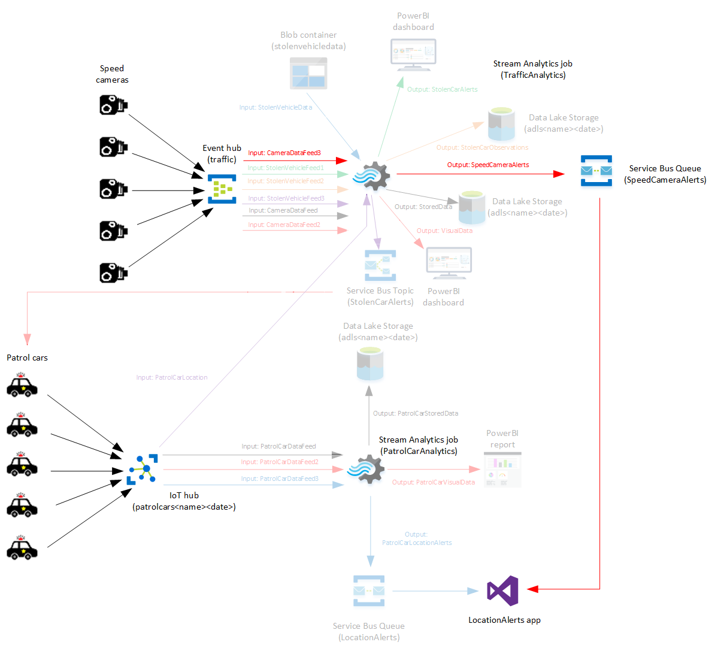
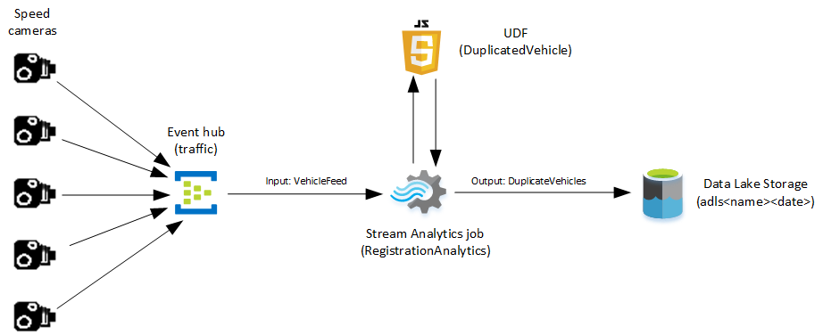

# Module 3: Performing Custom Processing in Azure Stream Analytics

- [Module 3: Performing Custom Processing in Azure Stream Analytics](#module-3-performing-custom-processing-in-azure-stream-analytics)
    - [Lab: Performing custom processing with Stream Analytics](#lab-performing-custom-processing-with-stream-analytics)
        - [Scenario](#scenario)
        - [Objectives](#objectives)
        - [Lab Setup](#lab-setup)
    - [Exercise 1: Use a Stream Analytics UDF function to identify specific data points](#exercise-1-use-a-stream-analytics-udf-function-to-identify-specific-data-points)
        - [Scenario](#scenario)
        - [Task 1: Update the event hub and add a consumer group](#task-1-update-the-event-hub-and-add-a-consumer-group)
        - [Task 2: Add a queue to the Service Bus namespace](#task-2-add-a-queue-to-the-service-bus-namespace)
        - [Task 3: Configure the Location Alerts app](#task-3-configure-the-location-alerts-app)
        - [Task 4: Reconfigure the TrafficAnalytics Stream Analytics job](#task-4-reconfigure-the-trafficanalytics-stream-analytics-job)
        - [Task 5: Start the Stream Analytics jobs](#task-5-start-the-stream-analytics-jobs)
        - [Task 6: Start the Speed Camera app](#task-6-start-the-speed-camera-app)
        - [Task 7: Start the Patrol Car app](#task-7-start-the-patrol-car-app)
        - [Task 8: Start the Location Alerts app](#task-8-start-the-location-alerts-app)
        - [Task 9: View the results](#task-9-view-the-results)
        - [Task 10: Close jobs and apps](#task-10-close-jobs-and-apps)
    - [Exercise 2: Use a Stream Analytics UDF to identify duplicate data records](#exercise-2-use-a-stream-analytics-udf-to-identify-duplicate-data-records)
        - [Scenario](#scenario)
        - [Task 1: Update the event hub and add a consumer group](#task-1-update-the-event-hub-and-add-a-consumer-group)
        - [Task 2: Create and configure a new Stream Analytics job](#task-2-create-and-configure-a-new-stream-analytics-job)
        - [Task 3: Start the Speed Camera app](#task-3-start-the-speed-camera-app)
        - [Task 4: Examine the generated data](#task-4-examine-the-generated-data)
        - [Task 5: Close jobs and apps](#task-5-close-jobs-and-apps)
    - [Exercise 3: Use Machine Learning with Stream Analytics to identify data anomalies](#exercise-3-use-machine-learning-with-stream-analytics-to-identify-data-anomalies)
        - [Scenario](#scenario)
        - [Task 1: Update the event hub and add another consumer group](#task-1-update-the-event-hub-and-add-another-consumer-group)
        - [Task 2: Create and configure a new Stream Analytics job](#task-2-create-and-configure-a-new-stream-analytics-job)
        - [Task 3: Configure and start the Speed Camera app](#task-3-configure-and-start-the-speed-camera-app)
        - [Task 4: Stop the Speed Camera app and the CaptureTrafficData Stream Analytics job](#task-4-stop-the-speed-camera-app-and-the-capturetrafficdata-stream-analytics-job)
        - [Task 5: Download the training data](#task-5-download-the-training-data)
        - [Task 6: Create a Machine Learning workspace](#task-6-create-a-machine-learning-workspace)
        - [Task 7: Create a machine learning experiment](#task-7-create-a-machine-learning-experiment)
        - [Task 8: Create a trained model](#task-8-create-a-trained-model)
        - [Task 9: Expose the trained model as a web service](#task-9-expose-the-trained-model-as-a-web-service)
        - [Task 10: Add another consumer group to the Speed Camera event hub](#task-10-add-another-consumer-group-to-the-speed-camera-event-hub)
        - [Task 11: Create a new Service Bus queue](#task-11-create-a-new-service-bus-queue)
        - [Task 12: Create and configure a new Stream Analytics job](#task-12-create-and-configure-a-new-stream-analytics-job)
        - [Task 13: Start the Stream Analytics jobs](#task-13-start-the-stream-analytics-jobs)
        - [Task 14: Configure the Location Alerts app](#task-14-configure-the-location-alerts-app)
        - [Task 15: Start the Patrol Car and Speed Camera apps](#task-15-start-the-patrol-car-and-speed-camera-apps)
        - [Task 16: Start the Location Alerts app and view the results](#task-16-start-the-location-alerts-app-and-view-the-results)
        - [Task 17: Lab closedown](#task-17-lab-closedown)

## Lab: Performing custom processing with Stream Analytics

### Scenario

You work for Adatum as a data engineer, and you’ve been asked to build a traffic surveillance system for traffic police. This system must be able to analyze significant amounts of dynamically streamed data—captured from speed cameras and automatic number plate recognition (ANPR) devices—and then crosscheck the outputs against large volumes of reference data that holds vehicle, driver, and location information. Fixed roadside cameras, hand-held cameras (held by traffic police), and mobile cameras (in police patrol cars) are used to monitor traffic speeds and raise an alert if a vehicle is travelling too quickly for the local speed limit. The cameras also have built-in ANPR software that reads vehicle registration plates.

For the second phase of the project, you will use Stream Analytics, together with Event Hub, IoT Hubs, Service Bus, Machine Learning, and custom applications to:
- Post messages to a Service Bus queue for all vehicles that are speeding, by using a simple JavaScript UDF function to determine whether a vehicle’s speed is above a particular limit.
- Identify vehicles that appear to be using the same registration number, by using a JavaScript UDF function to determine whether a vehicle with the same registration (not necessarily speeding) has been spotted at two locations that are an impossible distance apart within a given timeframe.
- Identify traffic flow issues, such as road blockages, or excessive speeds, by using Machine Learning with Stream Analytics to detect consistent speed anomalies from a speed camera; for example, if speeds are consistently very low for a period, the cause could be a traffic accident or incident.

### Objectives

After completing this lab, you will be able to:

- Use a Stream Analytics UDF function to identify specific data points.
- Use a Stream Analytics UDF function to identify duplicate data records.
- Use Machine Learning with Stream Analytics to identify data anomalies.

### Lab Setup

Estimated time: 90 minutes
Virtual machine: **20776A-LON-DEV**
User name: **ADATUM\\AdatumAdmin**
Password: **Pa55w.rd**

> **Important**: Due to the CPU-intensive nature of some of the tasks performed by the applications in this lab, it is recommended that you assign at least 4 virtual processors to the 20776A-LON-DEV VM before starting this lab. To do this, perform the following steps:
>   1. Shutdown the 20776A-LON-DEV VM if it is currently running
>   2. Using Hyper-V Manager, right-click the 20776A-LON-DEV VM, and then click **Settings**
>   3. Click **Processor**
>   4. In the **Processor** pane, increase **Number of virtual processors** to 4
>   5. Click **OK**
>   6. Restart the 20776A-LON-DEV VM

This lab uses the following resources from Lab 2, all in resource group **CamerasRG**:

- **Data Lake Store**: adls&lt;_your name_&gt;&lt;_date_&gt;
- **Event Hub**: camerafeeds&lt;_your name_&gt;&lt;_date_&gt;
- **IoT Hub**: patrolcars&lt;_your name_&gt;&lt;_date_&gt;
- **Service Bus namespace**: locationalerts&lt;_your name_&gt;&lt;_date_&gt;
- **Storage account**: datastore&lt;_your name_&gt;&lt;_date_&gt;
- **Streaming Analytics jobs**: TrafficAnalytics, PatrolCarAnalytics

## Exercise 1: Use a Stream Analytics UDF function to identify specific data points

### Scenario

For the first part of this next phase of the traffic surveillance system, you will add functionality to identify speeding vehicles. In this exercise, you will add logic to the analytics that capture vehicle speeds, and post a message to a Service Bus queue for all vehicles that are speeding. You will add a simple JavaScript function that ascertains whether a vehicle is speeding. You will then use an updated version of the app from Lab 2 to display the velocity of cars that were caught speeding.



The main tasks for this exercise are as follows:

1. Update the event hub and add a consumer group
2. Add a queue to the Service Bus
3. Configure the Location Alerts app
4. Reconfigure the TrafficAnalytics Stream Analytics job
5. Start the Stream Analytics jobs
6. Start the Speed Camera app
7. Start the Patrol Car app
8. Start the Location Alerts app
9. View the results
10. Close jobs and apps

### Task 1: Update the event hub and add a consumer group

- In the **camerafeeds&lt;_your name_&gt;&lt;_date_&gt;** event hub, create a new consumer group called **cameradatafeed3**.

### Task 2: Add a queue to the Service Bus namespace

1. In the **locationalerts&lt;_your name_&gt;&lt;_date_&gt;** Service Bus namespace, create a new queue called **SpeedCameraAlerts**.
2. Copy the primary key for the **RootManageSharedAccessKey** policy for the Service Bus namespace to a new text file named **E:\\Labfiles\\Lab03\\Config\_details.txt**.

### Task 3: Configure the Location Alerts app

1. Start Visual Studio, and open the **E:\\Labfiles\\Lab03\\LocationAlerts\\LocationAlerts** project.
2. Edit the **ConfigSettings.txt** file, and replace the text **YourServiceBusName** with **locationalerts&lt;_your name_&gt;&lt;_date_&gt;**.
3. In the same file, replace the text **YourPrimaryKey** with the primary key for the Service Bus namespace you copied to **Config\_details.txt** in Task 2.
4. Build the solution, and verify that the app compiles successfully. Do not start the app.
5. Deploy the app locally, overwriting the existing installation.

### Task 4: Reconfigure the TrafficAnalytics Stream Analytics job

1. Using the Azure portal, add an Event Hub input to the **TrafficAnalytics Stream Analytics** job, with the following details:
    - **Input alias**: CameraDataFeed3
    - **Select Event Hub from your subscriptions**: selected
    - **Event Hub namespace**: camerafeeds&lt;_your name_&gt;&lt;_date_&gt;
    - **Event Hub name**: Use existing, and select traffic
    - **Event Hub policy name**: RootManageSharedAccessKey
    - **Event Hub consumer group**: cameradatafeed3
    - Leave all other settings at their defaults
2. Add a Service Bus queue output to the **TrafficAnalytics Stream Analytics** job, with the following details:
    - **Output alias**: SpeedCameraAlerts
    - **Select queue from your subscriptions**: selected
    - **Service Bus namespace**: locationalerts&lt;_your name_&gt;&lt;_date_&gt;
    - **Queue name**: Use existing, and select speedcameraalerts
    - **Queue policy name**: RootManageSharedAccessKey
    - Leave all other settings at their defaults
3. Add a JavaScript UDF function named **IsSpeeding** to the **TrafficAnalytics Stream Analytics job**.
4. Set the **Output Type** to **any**, and replace the template function with the following code:

    ```JavaScript
    // UDF that returns an integer value indicating whether a vehicle is speeding
    function main(speedLimit, speed) {
      return (speed > speedLimit) ? 1 : 0;
    }
    ```

You can copy this code from the file **E:\\Labfiles\\Lab03\\UDF1.txt**.

5. Add the following statement to the end of the existing query. This new query sends information about speeding cars to the speed camera message queue:

    ```SQL
    SELECT
      CameraID,LocationLatitude,LocationLongitude,SpeedLimit,VehicleRegistration,Speed
    INTO
      SpeedCameraAlerts
    FROM
      CameraDataFeed3
    WHERE
      UDF.IsSpeeding(SpeedLimit, Speed) = 1
    ```

You can copy this query from the file **E:\\Labfiles\\Lab03\\ASAquery1.txt**.

6. Set the number of streaming units for the stream analytics job to **12**, if this is not already set.

### Task 5: Start the Stream Analytics jobs

1. Start the **TrafficAnalytics** and **PatrolCarAnalytics** Stream Analytics jobs.
2. Wait until the jobs have been successfully started before continuing with the lab.

### Task 6: Start the Speed Camera app

1. Find the primary key for the **RootManageAccessKey** policy of the **camerafeeds&lt;_your name_&gt;&lt;_date_&gt;** Event Hub Namespace, and record it in the **E:\\Labfiles\\Lab03\\Config\_details.txt** file.
2. Using Visual Studio, and open the **E:\\Labfiles\\Lab03\\SpeedCameraDevice\\SpeedCameraDevice** project.
3. In App.config, in the **appSettings** section, in the **ServiceBusConnectionString** key, replace the text **YourNamespace** with **camerafeeds&lt;_your name_&gt;&lt;_date_&gt;**, and replace **YourPrimaryKey** with the event hub primary key you copied to **Config\_details.txt**.
4. Set **SpeedCameraDriver** as the **Startup Project**.
5. Build the solution, verify that the app compiles successfully, and then start the app. The app opens a console window displaying generated speed camera data that is being sent to the event hub.

### Task 7: Start the Patrol Car app

1. Find the primary key for the **iothubowner** policy of the **patrolcars&lt;_your name_&gt;&lt;_date_&gt;** IoT hub, and record it in the **E:\\Labfiles\\Lab03\\Config\_details.txt** file.
2. Start another instance instance of Visual Studio, and open the **E:\\Labfiles\\Lab03\\PatrolCarDevice\\PatrolCarDevice** project.
3. In App.config, in the **appSettings** section, in the **ServiceBusConnectionString** key, replace **YourServiceBusName** with **locationalerts&lt;_your name_&gt;&lt;_date_&gt;**, and replace **YourServiceBusPrimaryKey** with the Service Bus primary key you copied to **Config\_details.txt**.
4. In App.config, in the **appSettings** section, in the **IoTHubConnectionString** and **IotHubUri** keys, replace **YourIoTHub** with **patrolcars&lt;_your name_&gt;&lt;_date_&gt;**.
5. Also in App.config, in the **IoTHubConnectionString** key, replace the SharedAccessKey value **YourIoTHubPrimaryKey** with the SharedAccessKey from the IoT Hub connection string you copied to **Config\_details.txt**.
6. Build the solution, verify that the app compiles successfully, and then start the app. The app opens a console window displaying the generated positions of patrol cars that are being sent to the IoT Hub.

### Task 8: Start the Location Alerts app

1. Start the **LocationAlerts** app.
2. Verify that the app displays a map (of London), and starts to show the positions of speeding vehicles (and their speed), and the positions of dispatched patrol cars.

    > **Note**: The map may take a few seconds to display initially, and you might also need to wait before all the data appears on the map.

### Task 9: View the results

1. Let the system run for a few minutes, to give it time to detect some speeding vehicles, and then observe the fun!
2. Note that the PatrolCarDevice project reports messages when a patrol car is dispatched to chase a speeding vehicle. You should also see the location of the patrol car change to move to the location reported for the speeding vehicle in the LocationAlerts app.

### Task 10: Close jobs and apps

1. Close the PatrolCarAnalytics and TrafficAnalytics jobs.
2. Reset the **TrafficAnalytics** job to use **1** streaming unit.
3. Stop the LocationAlerts, PatrolCar, and SpeedCameraDevice apps.
4. Close all the instances of Visual Studio.

>**Result**: In this exercise, you:
    - Added a new consumer group to your event hub, 
    - Added a new queue to your Service Bus, 
    - Reconfigured an existing Stream Analytics job to use these resources,
    - Added a UDF that returns an integer value indicating whether a vehicle is speeding,
    - Tested this logic.

## Exercise 2: Use a Stream Analytics UDF to identify duplicate data records

### Scenario

For the next part of the traffic surveillance system, you will build logic to identify vehicles that appear to be using the same registration number. This could be indicative of a stolen vehicle running on false plates. In this exercise, you will use a JavaScript function to determine whether a vehicle with the same registration (not necessarily speeding) has been spotted at two locations that are an impossible distance apart within a given timeframe. You will store the details (times, registrations, locations), and this data will be used in a later lab exercise.



The main tasks for this exercise are as follows:

1. Update the event hub and add a consumer group
2. Create and configure a new Stream Analytics job
3. Start the Speed Camera app
4. Examine the generated data
5. Close jobs and apps

### Task 1: Update the event hub and add a consumer group

- Add a new consumer group called **vehiclefeed** to the **traffic** event hub.

### Task 2: Create and configure a new Stream Analytics job

1. Create a new Stream Analytics job with the following details:
    - **Job name**: RegistrationAnalytics
    - **Resource group**:  Use existing, and  select CamerasRG.
    - **Location**: select the same location as you used for the Data Lake Store
    - **Streaming units**: 3
2. Wait until the Stream Analytics job has deployed before continuing with the lab.
3. Add a Data Lake Store output to the RegistrationAnalytics Stream Analytics job, with the following details:
    - **Output alias**: DuplicateVehicles
    - **Select Data Lake Store from your subscriptions**: selected
    - **Account name**: adls&lt;_your name_&gt;&lt;_date_&gt;
    - **Path prefix pattern**: Duplicates/{date}/{time}
    - Click **Authorize**
    - Leave all other settings at their defaults
4. Wait until the output has been successfully created before continuing with the lab.
5. Add an input to the RegistrationAnalytics Stream Analytics job, with the following details:
    - **Input alias**: VehicleFeed
    - **Select Event Hub from your subscriptions**: selected
    - **Event Hub namespace**: camerafeeds&lt;_your name_&gt;&lt;_date_&gt;
    - **Event Hub name**: Use existing, and select traffic
    - **Event Hub consumer group**: vehiclefeed
    - Leave all other settings at their defaults
6. Wait until the input has been successfully created before continuing with the lab.
7. Add a JavaScript UDF function with the alias **DuplicatedVehicle** to the RegistrationAnalytics Stream Analytics job, 
8. Replace the template function code text with the code from the file **E:\\Labfiles\\Lab03\\UDF2.txt**. This UDF iterates through the list of vehicles captured during the latest time window and examines the data to determine whether a vehicle with the same registration number has been spotted at two or more locations. If so, the UDF determines the distance between the two locations and calculates whether it is possible for the vehicle to have travelled between these points in the time available. If not, the registration number is flagged as a possible duplicate.
9. Add the following query to the RegistrationAnalytics Stream Analytics job to send information about suspicious vehicles to the Data Lake Store:

    ```SQL
    SELECT
      UDF.DuplicatedVehicle(Collect())
    INTO
      DuplicateVehicles
    FROM
      VehicleFeed
    GROUP BY
      TumblingWindow(minute, 2)
    ```
You can copy this query from the file **E:\\Labfiles\\Lab03\\ASAquery2.txt**.

10. Start the RegistrationAnalytics Stream Analytics job. Wait until the job has been successfully started before continuing with the lab.

### Task 3: Start the Speed Camera app

1. Start Visual Studio, and open the **E:\\Labfiles\\Lab03\\SpeedCameraDevice2\\SpeedCameraDevice** project.
2. In **App.config**, in the **appSettings** section, in the **ServiceBusConnectionString** key, replace **YourNamespace** with **camerafeeds&lt;_your name_&gt;&lt;_date_&gt;**, and replace **YourPrimaryKey** with the event hub primary key you copied to **Config\_details.txt** in Exercise 1.
3. Set **SpeedCameraDriver** as the **Startup Project**.
4. Build the solution, verify that the app compiles successfully, and then start the app. The app opens a console window displaying generated speed camera data that is being sent to the event hub.

### Task 4: Examine the generated data

1. Use the Data Explorer in the Data Lake blade of the Azure portal to view the contents of the JSON file in the Data Lake Duplicates folder.
2. Verify that the data includes duplicate registration numbers, and the locations at which they have been detected.

### Task 5: Close jobs and apps

1. Close the **RegistrationAnalytics** job.
2. Stop the **SpeedCameraDevice** app.
3. Close Visual Studio.

>**Result**: In this exercise, you added a new consumer group to your event hub, and created a new Stream Analytics job that uses a UDF to identify duplicate vehicle registrations. You tested this logic using a Visual Studio app.

## Exercise 3: Use Machine Learning with Stream Analytics to identify data anomalies

### Scenario

For the final part of this phase of the traffic surveillance system, you will use Machine Learning with Stream Analytics to detect speed anomalies from a speed camera. A typical anomaly is persistently slow traffic at a point where the speed is usually much higher.

In this exercise, you will start by capturing the typical traffic spped profile across all speed cameras. You will use this data to train a Machine Learning model. You will subsequently apply this model to the speeds reported by the cameras to detect whether there is any unusual behavior. If speeds are consistently very low for a period, the cause could be a traffic accident or other type of incident, so you should display a message onscreen using an updated version of the app from Exercise 1.

The main tasks for this exercise are as follows:

1. Update the event hub and add another consumer group
2. Create and configure a new Stream Analytics job
3. Configure and start the Speed Camera app
4. Stop the Speed Camera app and the CaptureTrafficData Stream Analytics job
5. Download the training data
6. Create a Machine Learning workspace
7. Create a machine learning experiment
8. Create a trained model
9. Expose the trained model as a web service
10. Add another consumer group to the Speed Camera event hub
11. Create a new Service Bus queue
12. Create and configure a new Stream Analytics job
13. Start the Stream Analytics jobs
14. Configure the Location Alerts app
15. Start the Patrol Car and Speed Camera apps
16. Start the Location Alerts app and view the results
17. Lab closedown

### Task 1: Update the event hub and add another consumer group

- Add a new consumer group called **cameradatafeed4** to the **traffic** event hub.

### Task 2: Create and configure a new Stream Analytics job

1. Create a new Stream Analytics job called **CaptureTrafficData**, with the following details:
    - **Job name**: CaptureTrafficData
    - **Resource group**: Use existing, and select CamerasRG
    - **Location**: select the same location as you used for the Data Lake Store
    - **Streaming units**: 3
2. Wait until the Stream Analytics job has deployed before continuing with the lab.
3. Add an Event Hub input to the CaptureTrafficData Stream Analytics job, with the following details:
    - **Input alias**: CameraDataFeed4
    - **Select Event Hub from your subscriptions**: selected
    - **Event Hub namespace**: camerafeeds&lt;_your name_&gt;&lt;_date_&gt;
    - **Event Hub name**: Use existing, and select traffic
    - **Event hub consumer group**: cameradatafeed4
    - Leave all other settings at their defaults
4. Add a Data Lake Store output to the CaptureTrafficData Stream Analytics job, with the following details:
    - **Output alias**: TrafficData
    - **Select Data Lake Store from your subscriptions**: selected
    - **Account name**: adls&lt;_your name_&gt;&lt;_date_&gt;
    - **Path prefix pattern**: TrafficTrainingData/
    - **Event serialization format**: CSV
    - Click **Authorize**
    - Leave all other settings at their defaults
5. Add the following query to the CaptureTrafficData Stream Analytics job:

    ```SQL
    SELECT
      CameraID,Speed,DATEPART(hour, Time)
    AS
      HourOfDay
    INTO
      TrafficData
    FROM
      CameraDataFeed4
    ```

You can copy this query from fuke file **E:\\Labfiles\\Lab03\\ASAquery3.txt**.

6. Start the CaptureTrafficData Stream Analytics job. Wait until the job has been successfully started before continuing with the lab.

### Task 3: Configure and start the Speed Camera app

1. Start Visual Studio, and open the **E:\\Labfiles\\Lab03\\SpeedCameraDevice3\\SpeedCameraDevice.sln** project.
2. In **App.config**, in the **appSettings** section, in the **ServiceBusConnectionString** key, replace **YourNamespace** with **camerafeeds&lt;_your name_&gt;&lt;_date_&gt;**, and replace **YourPrimaryKey** with the event hub primary key you copied to **Config\_details.txt in Lab 2, Ex 3**.
3. Set **SpeedCameraDriver** as the **Startup Project**.
4. Build the solution, verify that the app compiles successfully, and then start the app.
5. Let the app run for at least five minutes.

### Task 4: Stop the Speed Camera app and the CaptureTrafficData Stream Analytics job

1. Stop the Speed Camera app and the CaptureTrafficData Stream Analytics job.
2. Use Data Explorer for your Data Lake Storege account in the Azure portal to view the CSV file in the **TrafficTrainingData** folder. Verify that the data includes the speed camera name, recorded traffic speed, and time from your Stream Analytics query.

    > **Note**: The Speed Camera file also generates the file **E:\\Labfiles\\Lab03\\CameraData.csv** on the virtual machine. This file contains the locations of the cameras used by the training run. For consistency, when you run the app in "non-training" mode, it will read these same locations for the speed cameras. If you run the app in training mode again, make sure that you delete this file first, otherwise you will get duplicate speed cameras—but at different locations.

### Task 5: Download the training data

1. Download the CSV file containing the vehicle speed data from your Data Lake Storage account, and save it as **E:\\Labfiles\\Lab03\\TrafficData.csv**.
2. Open this file in Excel, and verify that the downloaded file contains data on speed camera name, recorded traffic speed, and time.

### Task 6: Create a Machine Learning workspace

1. Using the Azure portal, create a new Machine Learning workspace with the following details:
    - **Workspace name**: Traffic
    - **Resource group**: Use existing, and  select CamerasRG
    - **Location**: Select the nearest location to the one you used for the Data Lake Store.
    - **Storage account**: Create new, and then in the box, type **traffic&lt;_your name_&gt;&lt;_date_&gt;**
    - **Workspace pricing tier**: Standard
    - **Web service plan**: Create new, and accept the default name
    - Click **Web service plan pricing tier**, click **DEVTEST Standard**, and then click **Select**.
2. Wait until the workspace has been deployed before continuing.

### Task 7: Create a machine learning experiment

1. Launch Machine Learning Studio, and, if prompted, sign in using your Azure account credentials.
2. Upload **E:\\Labfiles\\Lab03\\TrafficData.csv** as a new dataset, with the type **Generic CSV File with a header**.
3. Create a new blank experiment.
4. Drag the **TrafficData.csv** dataset to the workspace canvas.
5. Add a **Split Data** module to the experiment canvas, below the dataset.
6. Connect the output of **TrafficData.csv** to the upper input port of the **Split Data** module.
7. In the **Split Data** properties, set the **Fraction of rows** to **0.7**.
8. Drag a **Train Anomaly Detection Model** module to the experiment canvas, below the **Split Data** module.
9. Connect the leftmost output of the **Split Data** module to the upper right input port of the **Train Anomaly Detection Model** module (this is the Dataset input).
10. Drag a **One-Class Support Vector Machine Model** module to the experiment canvas, to the left of the **Split Data** module.
11. Connect the output of the **One-Class Support Vector Machine Model** module to the upper left input port of the **Train Anomaly Detection Model** module (this is the untrained model input).
12. Drag a **Score Model** module to the experiment canvas, below the **Train Anomaly Detection Model** module.
13. Connect the output of the **Train Anomaly Detection Model** module to the leftmost input of the **Score Model** module (this is the trained model input), and the rightmost output of the **Split Data** module to the rightmost input of the **Score Model** module (this is the Dataset input).
14. Save the experiment, and then run it.
15. When the experiment has finished running, all modules will show a green check mark to indicate that they have successfully finished.

### Task 8: Create a trained model

1. Save the Train Anomaly Detection Model module as a trained model called **Trained TrafficSpeeds**.
2. Delete the **One-Class Support Vector Machine** and **Train Anomaly Detection Model** modules.
3. Drag **Trained TrafficSpeeds** to the experiment canvas, to the left of the **Split Data** module.
4. Connect the output of the **Trained TrafficSpeeds** module to the leftmost input of the **Score Model** module.

### Task 9: Expose the trained model as a web service

1. Create the web service for the model.
2. Delete the connection from the **Web service input** module to the **Split Data** module.
3. Connect the output of the **Web service input** module to the rightmost input of the **Score Model** module.
4. Save the experiment, and then run it (to validate the changes).
5. When the experiment has finished running, all modules will show a green check mark to indicate that they have successfully finished.
6. Deploy the web service, in Classic mode.
7. Copy the **API key** to the **E:\\Labfiles\\Lab03\\Config\_details.txt** file.
8. Go to the **New Web Services Experience** for the experiment, and configure the endpoint with the description: **Traffic speed anomaly detection web service**.
9. From the **Use endpoint** page, copy the **Request-Response** URL, and save it to **Config\_details.txt** file.

### Task 10: Add another consumer group to the Speed Camera event hub

- In the traffic event hub, create a new consumer group called **cameraspeedanomalyfeed**.

### Task 11: Create a new Service Bus queue

1. Create a new Service Bus queue called **TrafficJamAlerts**.
2. Wait until the queue has been successfully created before continuing with the lab.

### Task 12: Create and configure a new Stream Analytics job

1. Create a new Stream Analytics job with the following details:
    - **Job name**: DetectSpeedAnomalies.
    - **Resource group**: Use existing, and select CamerasRG.
    - **Location**: select the same location as you used for the Data Lake Store
    - **Streaming units**: 12
2. Wait until the Stream Analytics job has deployed before continuing with the lab.
3. Add an Event Hub input to the **DetectSpeedAnomalies** Stream Analytics job, with the following details:
    - **Input alias**: SpeedCameraData
    - **Select Event Hub from your subscriptions**: selected
    - **Event Hub namespace**: camerafeeds&lt;_your name_&gt;&lt;_date_&gt;
    - **Event Hub name**: Use existing, and select traffic
    - **Event hub consumer group**: cameraspeedanomalyfeed
    - Leave all other settings at their defaults
4. Add a Data Lake Store output to the **DetectSpeedAnomalies** Stream Analytics job, with the following details:
    - **Output alias**: TrafficData
    - **Select Data Lake Store from your subscriptions**: selected
    - **Account name**: adls&lt;_your name_&gt;&lt;_date_&gt;
    - **Path prefix pattern**: SpeedAnomalyData/
    - **Event serialization format**: JSON
    - Click **Authorize**
    - Leave all other settings at their defaults
5. Add an Azure ML function to the **DetectSpeedAnomalies** Stream Analytics job, with the following details:
    - **Function Alias**: SpeedAnomaly
    - **Provide Azure Machine Learning function settings manually**: selected
    - **URL**: The Request-Response URL that you copied to the **Config\_details.txt** file.
    - **Key**: The web service API key that you copied to the **Config\_details.txt** file.
6. Add Service Bus queue output to the **DetectSpeedAnomalies** Stream Analytics job, with the following details:
    - **Output alias**: TrafficJamAlerts
    - **Select queue from your subscriptions**: selected
    - **Service Bus namespace**: locationalerts&lt;_your name_&gt;&lt;_date_&gt;
    - **Queue name**: trafficjamalerts
    - Leave all other settings at their defaults
7. Add the following query to the **DetectSpeedAnomalies** Stream Analytics job:

    ```SQL
    WITH
      SpeedAnomalies
    AS
      (SELECT 
        CameraID,
        AVG(Speed) AS AvgSpeed, 
        SpeedAnomaly(CameraID, AVG(Speed), DATEPART(hour, MAX(Time))) AS Results,
        DATEPART(hour, MAX(Time)) AS HourOfDay
    FROM
      SpeedCameraData
    TIMESTAMP BY
      Time
    GROUP BY
      CameraID, TumblingWindow(minute, 2))

    SELECT
      CameraID, AvgSpeed, HourOfDay
    INTO
      TrafficData
    FROM
      SpeedAnomalies
    WHERE
      Results.[Scored Labels] = '1'

    SELECT
      CameraID, AvgSpeed
    INTO
      TrafficJamAlerts
    FROM
      SpeedAnomalies
    WHERE
      Results.[Scored Labels] = '1'
    ```

You can copy these commands from the file **E:\\Labfiles\\Lab03\\ASAquery4.txt**.

### Task 13: Start the Stream Analytics jobs

1. Start the **DetectSpeedAnomalies**, **TrafficAnalytics** and **PatrolCarAnalytics** Stream Analytics jobs.
2. Wait until the jobs have been successfully started before continuing with the lab.

### Task 14: Configure the Location Alerts app

1. Start a new instance of Visual Studio, and open the **E:\\Labfiles\\Lab03\\LocationAlerts2\\LocationAlerts** project.
2. Edit **ConfigSettings.txt**, and replace **YourServiceBusName** with **locationalerts&lt;_your name_&gt;&lt;_date_&gt;**.
3. Edit **ConfigSettings.txt**, and replace **YourPrimaryKey** with the primary key from the Service Bus connection string you copied to **Config\_details.txt** in Exercise 2.
4. Build the solution, and verify that the app compiles successfully.
5. Deploy the app, but do not start it running.

### Task 15: Start the Patrol Car and Speed Camera apps

1. Using the same instance of Visual Studio, open the **E:\\Labfiles\\Lab03\\PatrolCarDevice\\PatrolCarDevice** project. This is the same app that you ran in Exercise 1; it should already be configured correctly.
2. Start the app, and verify that the app opens a console window displaying the generated positions of patrol cars that are being sent to the IoT Hub.
3. In the **SpeedCameraDevice** instance of Visual Studio, in **App.config**, in the **appSettings** section, in the **TrainingRun** key, replace **true** with **false**.
4. Build the solution, verify that the app compiles successfully, and then start the app. Verify that the app opens a console window displaying generated speed camera data that is being sent to the event hub.

### Task 16: Start the Location Alerts app and view the results

- Start the **LocationAlerts** app. The app displays a map (of London), and starts to show the positions of speeding anomalies, the positions of dispatched patrol cars, and traffic blockage alert messages where traffic is not moving (speeds = 0 mph). Note that it will take a couple of minutes before alerts start to appear. Thereafter, alerts will appear in batches at approximately two-minute intervals. This is because the query used by the **DetectSpeedAnomalies** job aggregates data across a two-minute time window.

### Task 17: Lab closedown

1. Stop the **TrafficAnalytics**, **DetectSpeedAnomalies**, and **PatrolCarAnalytics** jobs.
2. Reset the **DetectSpeedAnomalies** jobs to use **1** streaming unit.
3. Close the **LocationAlerts**, **PatrolCarDevice**, and **SpeedCameraDevice** apps.
4. Do not remove the Azure resources (resource group, Stream Analytics jobs, event hub, IoT hub, and storage); these resources will be used in later labs.
5. Close Internet Explorer.

>**Result**: In this exercise, you added new consumer groups to your event hub, and created a new Stream Analytics job that works with a Visual Studio app to generate training data. You created a machine learning experiment to detect anomalous data, train your model using the generated training data, and then deployed the trained model as a web service. You created another Stream Analytics job that uses the Machine Learning web service to detect anomalies in data in the input stream.

**Question**: How might you use Stream Analytics UDF functions to identify specific data points within your organization?

**Question**: What requirements does your organization have for deduplicating information?

---

©2018 Microsoft Corporation. All rights reserved.

The text in this document is available under the [Creative Commons Attribution 3.0 License](https://creativecommons.org/licenses/by/3.0/legalcode), additional terms may apply. All other content contained in this document (including, without limitation, trademarks, logos, images, etc.) are **not** included within the Creative Commons license grant. This document does not provide you with any legal rights to any intellectual property in any Microsoft product. You may copy and use this document for your internal, reference purposes.

This document is provided "as-is." Information and views expressed in this document, including URL and other Internet Web site references, may change without notice. You bear the risk of using it. Some examples are for illustration only and are fictitious. No real association is intended or inferred. Microsoft makes no warranties, express or implied, with respect to the information provided here.
